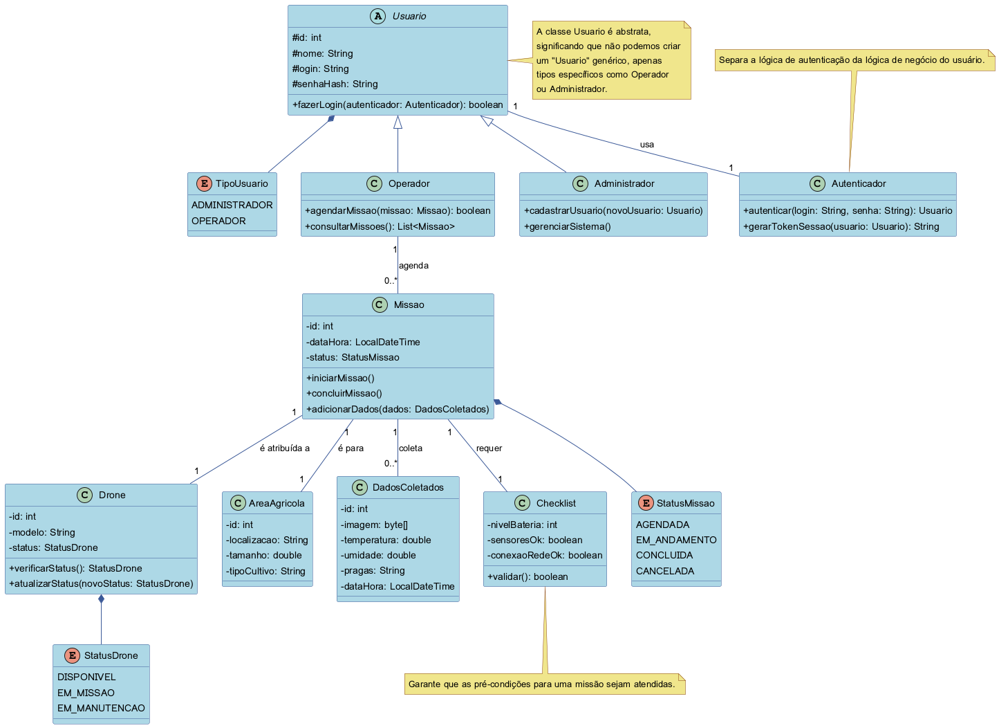
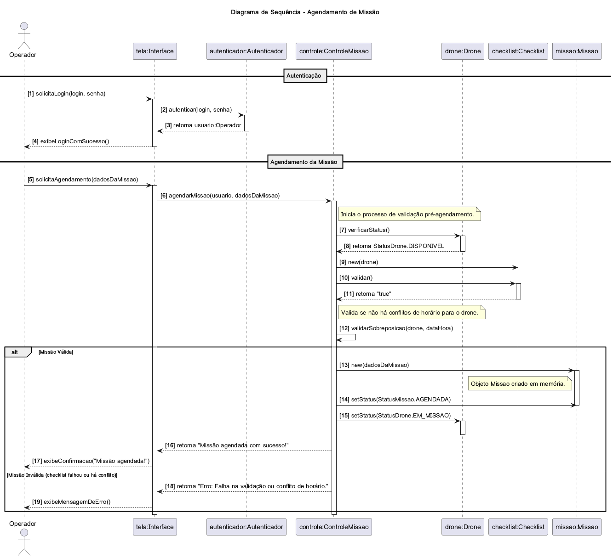
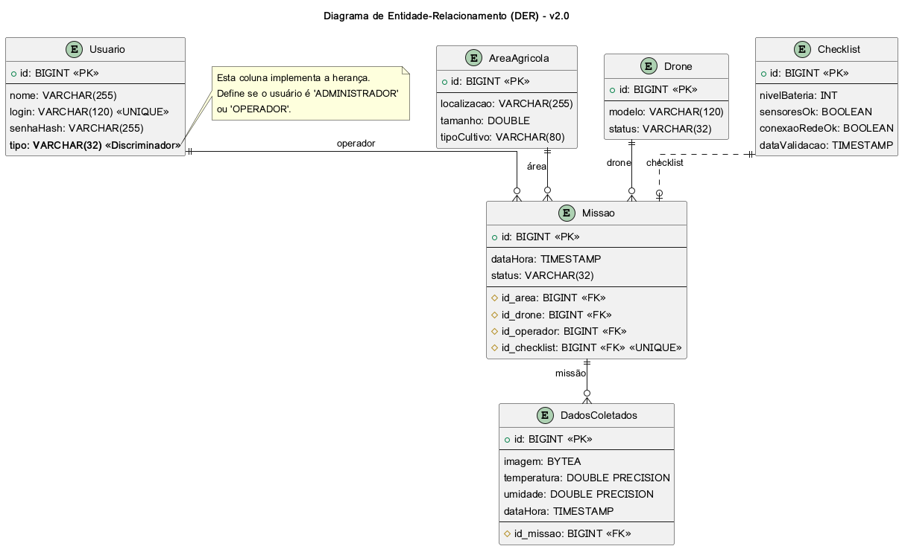

<h2><a href= "https://www.mackenzie.br">Universidade Presbiteriana Mackenzie</a></h2>

# Projeto: Sistema de Monitoramento de Plantações com Drones

# Grupo: Yan Andreotti dos Santos, Mateus Kage Moya

# Descrição

Este projeto tem como objetivo modelar e implementar um sistema de software seguro para uma cooperativa rural monitorar plantações usando drones. O sistema permitirá o cadastro de áreas agrícolas, drones, o agendamento de missões de voo para coleta de dados (como temperatura, umidade e imagens ) e a geração de relatórios básicos. A segurança é um requisito fundamental, sendo aplicada desde a fase de modelagem até a implementação final.

# Documentação

Os arquivos da documentação deste projeto estão na pasta [/docs](/docs), e o seu conteúdo é publicado em **https://<usuario>.github.io/UML-Classroom-FCI/blob/master/docs/index.md**

## Diagrama de Classes

O diagrama abaixo representa as principais entidades do sistema e seus relacionamentos.

> O código-fonte deste diagrama pode ser encontrado em: [`docs/DiagramClassesInicial.puml`](docs/DiagramClassesInicial.puml)

## Diagrama de Sequência

Este diagrama detalha o fluxo de interações para o caso de uso "Agendar uma Nova Missão".

> O código-fonte deste diagrama pode ser encontrado em: [`docs/DiagramaSequencialInicial.puml`](docs/DiagramaSequencialInicial.puml)

## Diagrama Banco de Dados

Este diagrama representa a estrutura das tabelas e relacionamentos do banco de dados SQL.

> O código-fonte deste diagrama pode ser encontrado em: [`docs/DiagramaSequencialInicial.puml`](docs/DiagramaSequencialInicial.puml)

# Releases

Deverá ser publicado um release ao término de cada entrega do projeto.
