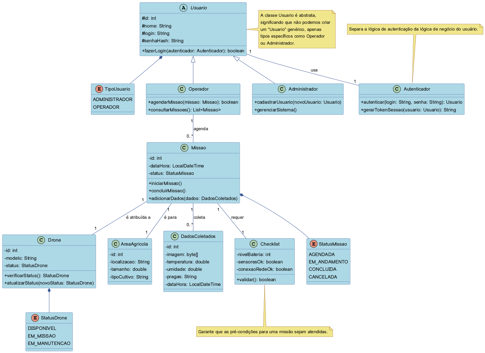

<h2><a href= "https://www.mackenzie.br">Universidade Presbiteriana Mackenzie</a></h2>
<h3><a href= "https://www.mackenzie.br/graduacao/sao-paulo-higienopolis/sistemas-de-informacao">Sistemas de Informação</a></h3>

Sistema de Monitoramento de Plantações com Drones

>*Observação 1: A estrutura inicial deste documento é só um exemplo. O seu grupo deverá alterar esta estrutura de acordo com o que está sendo solicitado na disciplina.*

>*Observação 2: O índice abaixo não precisa ser editado se você utilizar o Visual Studio Code com a extensão **Markdown All in One**. Essa extensão atualiza o índice automaticamente quando o arquivo é salvo.*

**Conteúdo**

- [Autores](#nome-alunos)
- [Descrição do Projeto](#introdução-do-projeto)
- [Análise de Requisitos Funcionais e Não-Fucionais](#descrição-dos-requisitos)
- [Diagrama de Atividades](#diagrama-de-atividades) 
- [Diagrama de Casos de Uso](#diagrama-de-comportamento-atores)
- [Descrição dos Casos de Uso](#descrição-das-funcões)
- [Diagrama de Senquencia](#diagrama-de-ordem-interações)
- [Diagrama de Classes](#diagrama-orientado-objetos)
- [Diagrama de Estados](#diagrama-estrutura-componente)
- [Diagrama de Implantação](#diagrama-de-hardware-software)
- [Referências](#referências)

# Autores

* Aluno 1
* Aluno 2
* Aluno 3
* Aluno 4
* Aluno 5
* Aluno 6
* Aluno 7
* Aluno 8

# Descrição do Projeto

O projeto consiste no desenvolvimento de um sistema de software para uma cooperativa rural, com o objetivo de gerenciar e automatizar o monitoramento de plantações através de drones. O sistema permitirá o cadastro de áreas agrícolas, drones e o agendamento de missões de voo para coletar dados essenciais como imagens, temperatura e umidade. Um dos pilares do projeto é a segurança da informação, que será aplicada desde a modelagem inicial até a implementação final do código, garantindo a integridade e a confidencialidade dos dados.

# Análise de Requisitos Funcionais e Não-Funcionais
### Requisitos Funcionais (O que o sistema deve fazer)
*   **RF01:** Cadastrar áreas agrícolas (com tamanho, localização e tipo de cultivo).
*   **RF02:** Cadastrar drones (com ID, sensores disponíveis e status).
*   **RF03:** Agendar missões de voo, especificando data, área e sensores a utilizar.
*   **RF04:** Registrar os dados coletados durante uma missão (imagens e valores de sensores).
*   **RF05:** Gerar relatórios básicos sobre as condições da plantação.

### Requisitos Não-Funcionais (Como o sistema deve ser)
*   **RNF01 (Segurança):** O sistema deve possuir controle de acesso diferenciado para perfis de **administrador** e **operador de drone**.
*   **RNF02 (Segurança):** O sistema deve validar e impedir o agendamento de missões sobrepostas para o mesmo drone.
*   **RNF03 (Segurança):** O sistema deve garantir o tratamento seguro dos dados dos sensores, evitando a persistência de dados inválidos ou corrompidos.
*   **RNF04 (Usabilidade):** O sistema deve ter uma interface clara para as operações de cadastro e agendamento.
*   **RNF05 (Segurança):** O sistema deve incluir um checklist de segurança antes do voo (bateria mínima, sensores funcionando).

# Diagrama de Atividades

*&lt;Diagrama para visualizer as pessoas das áreas de negócios e de desenvolvimento de uma organização para entender o processo e comportamento.&gt;*

# Diagrama de Casos de Uso

*&lt;Diagrama para visualizar o comportamento dos atores&gt;*

# Descrição dos Casos de Uso

*&lt;Descrição do comportamento entre os atores/resquisitos&gt;*

# Diagrama de Sequência

O diagrama a seguir detalha a sequência de interações para o caso de uso "Agendar Missão", demonstrando a validação de segurança para evitar conflitos.

# Diagrama de Classes

Este diagrama representa as classes principais do sistema, seus atributos, métodos e os relacionamentos entre elas.

# Diagrama de Estados

*&lt;Diagrama para permite modelar o comportamento interno de um determinado objeto, subsistema ou sistema global&gt;*

# Diagrama de Implantação

*&lt;Diagrama para exibir o relacionamento de hardware e software no projeto&gt;*

# Referências

*&lt;Lista de referências&gt;*
